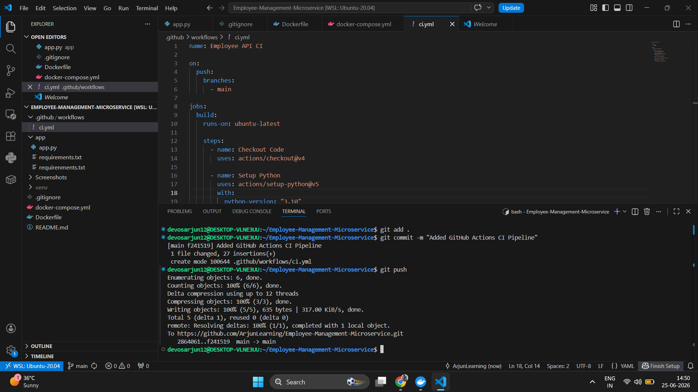
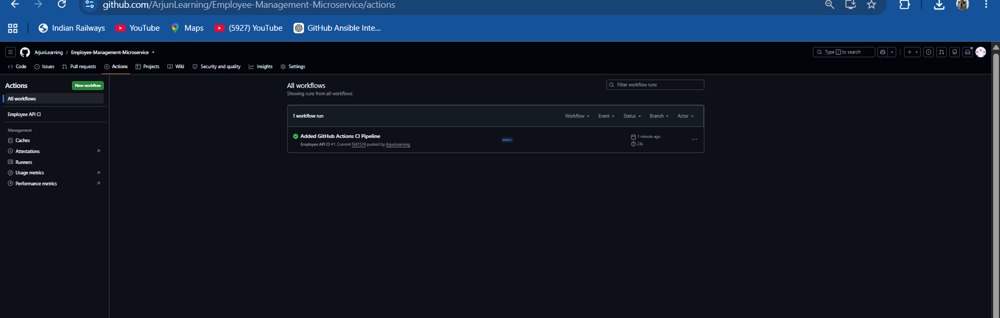
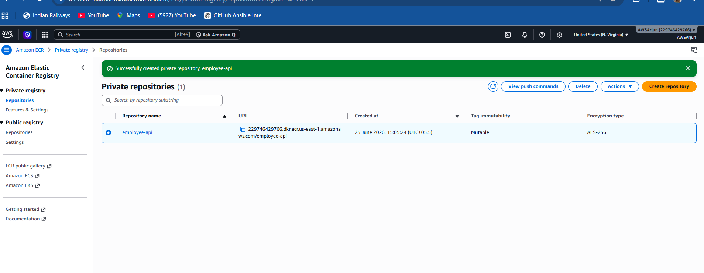
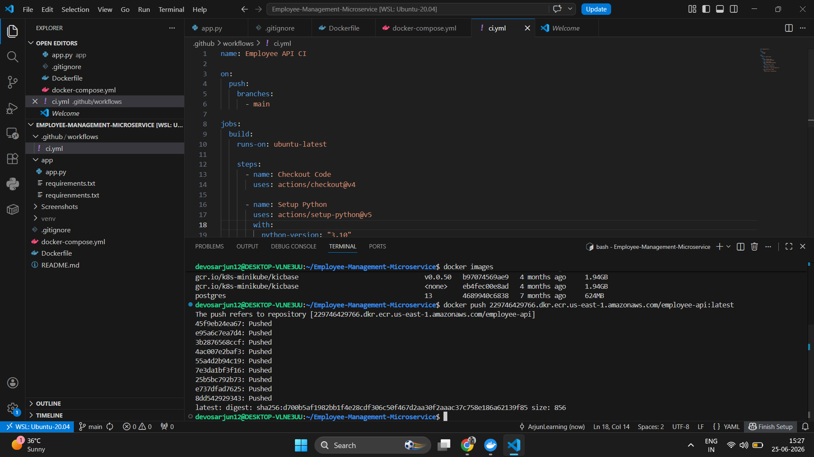
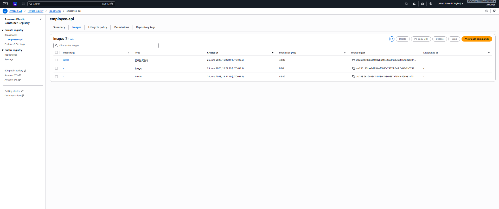
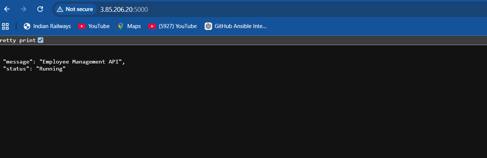
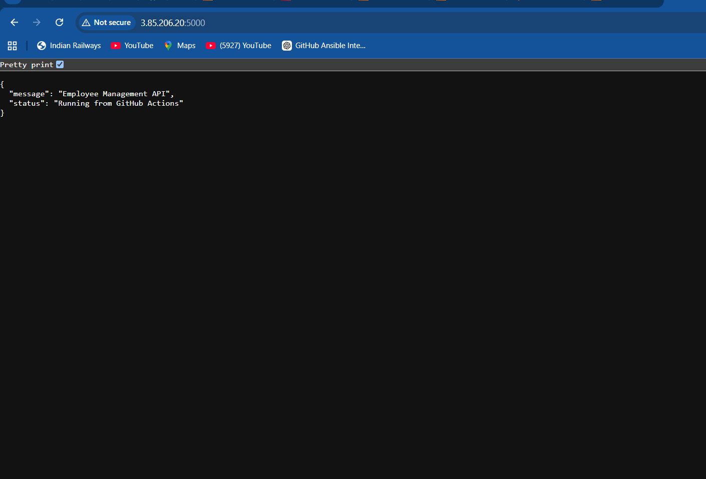

# 🚀 Employee Management Microservice

A production-ready Employee Management Microservice built using **Python Flask**, containerized with **Docker**, and deployed automatically to **AWS EC2** using **GitHub Actions CI/CD**.

---

## 📌 Project Overview

This project demonstrates an end-to-end DevOps CI/CD pipeline.

Whenever code is pushed to the **main** branch:

* GitHub Actions starts automatically.
* Docker image is built.
* Image is pushed to Amazon ECR.
* EC2 pulls the latest image.
* Existing container is replaced.
* New version is deployed automatically.

---

## 🛠 Tech Stack

* Python 3
* Flask
* Docker
* GitHub Actions
* Amazon EC2
* Amazon ECR
* AWS IAM

---

## 📂 Project Structure

```text
Employee-Management-Microservice/
│
├── .github/
│   └── workflows/
│       └── ci.yml
│
├── app/
│   ├── app.py
│   └── requirements.txt
│
├── Dockerfile
├── docker-compose.yml
├── README.md
└── .gitignore
```

---

## ⚙️ CI/CD Workflow

```text
Developer
     │
 Git Push
     │
 GitHub Actions
     │
 Docker Build
     │
 Amazon ECR
     │
 Amazon EC2
     │
 Docker Container
     │
 Live Application
```

---

## 🚀 Features

* Dockerized Flask Application
* Automated CI/CD Pipeline
* Amazon ECR Integration
* Automatic Deployment to EC2
* Containerized Deployment
* Production Style Workflow

---

## ▶️ Run Locally

Clone the repository

```bash
git clone https://github.com/ArjunLearning/Employee-Management-Microservice.git
```

Go to the project

```bash
cd Employee-Management-Microservice
```

Build Docker Image

```bash
docker build -t employee-api .
```

Run Container

```bash
docker run -d -p 5000:5000 employee-api
```

---

## 🌐 Live Deployment

The application is automatically deployed on an AWS EC2 instance through GitHub Actions after every push to the **main** branch.

---

## ## 📸 Screenshots

### 1. VS Code Project Structure & GitHub Actions Workflow


---

### 2. GitHub Actions Pipeline Success


---

### 3. Amazon ECR Repository Created


---

### 4. Docker Image Successfully Pushed to ECR


---

### 5. EC2 Instance Running


---

### 6. Security Group Configuration


---

### 7. Docker Image Push Command


---

### 8. Docker Container Running on EC2


---

### 9. Live Application Running


---

### 10. Final CI/CD Deployment Verification

---

## 👨‍💻 Author

**Arjun Singh**

DevOps | Cloud | AWS | Docker | GitHub Actions
